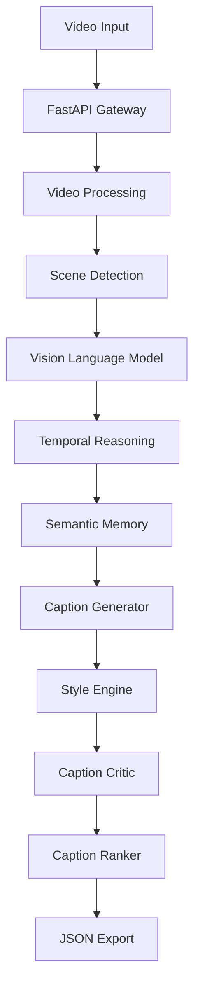

# System Architecture Document (SAD)

**Project:** CaptionForge AI  
**Document:** 10_System_Architecture.md  
**Version:** 1.0 (Iteration 1)

---

# Table of Contents

1. Executive Summary
2. Architectural Goals
3. Architecture Principles
4. Quality Attributes
5. System Context
6. High-Level Architecture

---

# 1. Executive Summary

CaptionForge AI is a production-grade multimodal video captioning platform designed for the AMD Developer Hackathon Track 2. The architecture emphasizes modularity, maintainability, observability, and AI-first design.

The system processes a video through a sequence of independent components that perform video preprocessing, scene understanding, temporal reasoning, semantic aggregation, caption generation, evaluation, ranking, and JSON export.

The architecture is intentionally modular so that AI models, prompts, and pipeline stages can evolve independently without affecting the rest of the application.

---

# 2. Architectural Goals

## Primary Goals

- Produce accurate captions.
- Support four required caption styles.
- Minimize hallucinations.
- Support hidden benchmark videos.
- Execute reliably inside Docker.

## Engineering Goals

- Modular services
- Loose coupling
- High cohesion
- Testability
- Configuration-driven behavior
- Production readiness

---

# 3. Architecture Principles

## AI First

Business logic is centered around the AI pipeline.

## Modular Components

Each module has one responsibility and communicates through well-defined interfaces.

## Stateless Processing

Pipeline stages avoid shared mutable state except through semantic memory objects.

## API First

Every capability should be callable through internal APIs.

## Configuration over Hardcoding

Models, prompts, thresholds, and runtime settings are configurable.

---

# 4. Quality Attributes

| Attribute | Target |
|-----------|--------|
| Accuracy | Very High |
| Reliability | High |
| Maintainability | High |
| Scalability | Medium |
| Observability | High |
| Security | High |
| Extensibility | High |

---

# 5. System Context

## Actors

- AMD Evaluation Platform
- Developer
- AI Models
- Docker Runtime

## External Dependencies

- Vision Language Model
- FFmpeg
- Python Runtime
- Docker

## System Boundary

The system receives a video reference, performs AI processing, and returns benchmark-compliant JSON.

---

# 6. High-Level Architecture

## Layered View

### Presentation Layer
- API Endpoints
- Health Checks

### Application Layer
- Workflow Orchestrator
- Request Validation
- Configuration

### AI Layer
- Scene Detection
- Vision Understanding
- Temporal Reasoning
- Caption Generation
- Caption Evaluation

### Infrastructure Layer
- Logging
- Configuration
- Docker
- File Storage

---

## Iteration Status

✅ Executive Summary

✅ Architectural Goals

✅ Architecture Principles

✅ Quality Attributes

✅ System Context

✅ High-Level Architecture

**Next Iteration**

- Logical Architecture
- Component Architecture
- Service Architecture
- Module Responsibilities
- Data Flow
- Sequence Diagrams
