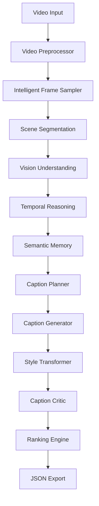

# AI Pipeline Design

**Project:** CaptionForge AI  
**Document:** 11_AI_Pipeline_Design.md  
**Version:** 1.0 (Iteration 1)

---

# Table of Contents

1. Executive Summary
2. AI Objectives
3. AI Design Principles
4. Pipeline Overview
5. Pipeline Architecture
6. Data Contracts
7. Stage Specifications
8. Initial Technology Choices

---

# 1. Executive Summary

CaptionForge AI uses a modular, multi-stage multimodal reasoning pipeline instead of relying on a single Vision-Language Model prompt. Each stage has a single responsibility and communicates through structured data contracts.

---

# 2. AI Objectives

- Maximize caption accuracy
- Generate four required styles
- Minimize hallucinations
- Preserve temporal context
- Enable modular model replacement
- Support Docker-first deployment

---

# 3. AI Design Principles

- Understand before generating.
- Separate reasoning from writing.
- Preserve factual consistency.
- Evaluate before returning.
- Prefer modular agents over monolithic prompts.
- Version prompts independently from code.

---

# 4. Pipeline Overview



---

# 5. Pipeline Architecture

| Stage | Responsibility | Output |
|---|---|---|
| Video Preprocessor | Validate & normalize | Clean video |
| Frame Sampler | Select key frames | Representative frames |
| Scene Detector | Detect scene boundaries | Scene timeline |
| Vision Engine | Detect objects/actions/context | Scene facts |
| Temporal Reasoner | Build event sequence | Event graph |
| Semantic Memory | Aggregate knowledge | Structured memory |
| Caption Planner | Create caption outline | Caption plan |
| Caption Generator | Produce factual caption | Base caption |
| Style Transformer | Generate 4 styles | Styled captions |
| Caption Critic | Evaluate quality | Scores |
| Ranker | Select best output | Final captions |
| JSON Export | Benchmark schema | JSON |

---

# 6. Data Contracts

Each stage exchanges structured JSON objects.

Example:

```json
{
  "scene_id":1,
  "objects":["person","bicycle"],
  "actions":["riding"],
  "location":"street",
  "timestamp":{"start":0.0,"end":4.2}
}
```

---

# 7. Stage Specifications

## 7.1 Video Preprocessor

Purpose:
- Validate input
- Normalize resolution
- Extract metadata

Input:
- Video URL or file

Output:
- Normalized video descriptor

Failure Modes:
- Invalid URL
- Unsupported format
- Corrupted media

---

## 7.2 Intelligent Frame Sampler

Purpose:
Select informative frames while avoiding redundancy.

Strategies:
- Adaptive sampling
- Motion-aware sampling
- Scene-aware sampling

Output:
Representative keyframes.

---

## 7.3 Scene Segmentation

Purpose:
Identify semantic scene boundaries instead of fixed intervals.

Outputs:
- Scene index
- Start/end timestamps
- Transition confidence

---

## 7.4 Vision Understanding

Responsibilities:
- Object recognition
- Action recognition
- Environment detection
- Human interaction analysis
- Context extraction

Output:
Structured scene understanding.

---

## 7.5 Temporal Reasoning

Builds chronological relationships across scenes.

Produces:
- Event graph
- Actor timeline
- Cause-effect hints

---

## 7.6 Semantic Memory

Maintains shared context for downstream agents.

Stores:
- Entities
- Events
- Relationships
- Scene summaries

---

# 8. Initial Technology Choices

Primary VLM:
- Qwen2.5-VL

Supporting Libraries:
- PyTorch
- Transformers
- OpenCV
- FFmpeg
- FastAPI

---

## Iteration Status

Completed:
- Executive Summary
- AI Objectives
- Design Principles
- Pipeline Overview
- Core Pipeline Architecture
- Data Contracts
- Stage Specifications (1–6)

Next Iteration:
- Caption Planning
- Caption Generation
- Style Transformation
- Caption Critic
- Ranking
- Prompt Engineering
- Model Interfaces
- Error Recovery
- Evaluation Metrics
