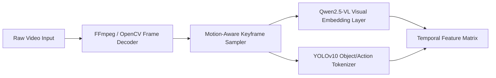
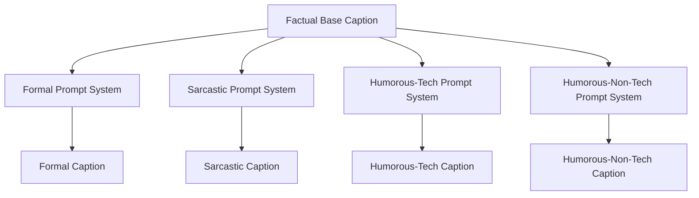

# AI Model Architecture

**Project:** CaptionForge AI  
**Document:** 17_AI_Model_Architecture.md  
**Version:** 1.0 (Production Blueprint)

---

## 1. Executive Summary
This document specifies the machine learning and model architecture for **CaptionForge AI**, engineered for Track 2 of the AMD Developer Hackathon. To prevent visual hallucinations and ensure strict adherence to the four mandatory styles (**Formal, Sarcastic, Humorous-Tech, Humorous-Non-Tech**), the system rejects a monolithic end-to-end vision prompt approach. Instead, it uses a decoupled **Extract-Reason-Style** multi-model architecture. This document outlines model selection, feature extraction pipelines, temporal aggregation networks, LLM orchestration, and the style translation framework.

## 2. Model Selection & Compute Framework
The architecture uses a mixture of localized visual-feature models and remote/local Large Language Models optimized for high structural precision and semantic fluency.

```text
ai_pipeline/
├── models/
│   ├── vision_extractor.py     # InternVL2 / Qwen2-VL video embeddings wrapper
│   ├── spatial_detector.py      # Localized object/action tagger (YOLOv10 / InternImage)
│   ├── temporal_reasoner.py    # Temporal window aggregator and graph builder
│   ├── caption_generator.py    # Factual base caption constructor
│   └── style_transformer.py    # Multi-headed stylistic prompt execution engine
├── prompts/
│   ├── base_caption.json       # Factual structured consolidation instructions
│   └── styles/
│       ├── formal.json         # Objective, professional reporting prompt
│       ├── sarcastic.json      # Dry, ironic, mocking inflection rules
│       ├── humorous_tech.json  # Programming and computer science joke injections
│       └── humorous_non_tech.json # Slapstick, everyday observational wit constraints
└── pipeline.py                 # Master execution graph orchestrator
```

### 2.1. Model Selection Matrix
| Pipeline Component | Selected Model | Scale / Variant | Operational Mode | Justification |
| :--- | :--- | :--- | :--- | :--- |
| **Primary Vision Engine** | **Qwen2.5-VL** | 7B / 72B Instruct | Local/API Integration | Elite native temporal understanding, high-resolution visual grounding, robust object/action tagging. |
| **Spatial Feature Tagger** | **YOLOv10** | Extra Large (XL) | Local Inference (PyTorch) | High-speed, zero-shot bounding-box object classification to feed raw structural verification lists to the pipeline. |
| **Reasoning & Styling Core** | **Llama-3.3** | 70B Instruct | API Client / Distributed | Industry-leading adherence to system prompts, high vocabulary range for distinct tone shifts. |

## 3. Spatial & Video Feature Extraction Pipeline
The pipeline processes video input through sequential stages to extract spatial and visual data before generating text captions.



### 3.1. Sampling and Spatial Feature Ingestion
1.  **Motion-Aware Sampling:** The system decodes raw video via OpenCV and calculates frame-to-frame pixel differences (optical flow). Frames are skipped during static sequences, while sampling density increases during high-velocity action transitions.
2.  **Object & Attribute Tokenization:** The sampled frames pass through the localized spatial feature tagger. This stage generates an inventory containing detected objects, relative locations, confidence levels, and active movement vectors.

## 4. Temporal Context & Graph Aggregation
To avoid text errors caused by analyzing frames out of order, spatial tokens are aggregated into a chronological event graph.

```json
{
  "video_metadata": { "duration_seconds": 45.0, "total_sampled_keyframes": 12 },
  "temporal_graph": [
    {
      "scene_id": 1,
      "timestamp_range": [0.0, 12.4],
      "environmental_context": "Modern open-plan corporate office, high daylight exposure",
      "persistent_entities": ["office worker", "desktop computer", "mechanical keyboard"],
      "action_sequence": ["worker typing intensely", "gazing at compilation errors on screen"]
    },
    {
      "scene_id": 2,
      "timestamp_range": [12.5, 45.0],
      "environmental_context": "Office desk layout close-up",
      "persistent_entities": ["office worker", "coffee mug", "computer mouse"],
      "action_sequence": ["worker rubbing temples in frustration", "taking a slow sip of cold coffee"]
    }
  ]
}
```

## 5. Factual Base Caption Generation
The raw temporal graph passes into the **Caption Planner & Generator** phase. This stage acts as an analytical filter, converting the structured JSON event log into a dense, non-stylized narrative summary.

*   **System Instructions:** Summarize the chronologically mapped entities and action strings into a unified factual paragraph. Avoid adding any humor, metaphors, or speculative assumptions.
*   **Verification Guardrails:** The engine cross-checks the output against the raw spatial token list to ensure that only verified objects and actions are included in the text narrative.

## 6. Style Transformation Engine
Once the factual base caption is established, it is routed into the Multi-Headed Style Transformer. This engine runs four parallel LLM sessions using targeted system prompts to transform the baseline text into the required competition output formats.



### 6.1. Stylistic Prompt Architectures
#### **Formal Style Rules**
*   **Objective:** Produce an objective, professional, and factual report.
*   **Instruction:** Write in the third person, use passive voice structures for process steps, and prioritize environmental settings and physical actions over emotional interpretations.

#### **Sarcastic Style Rules**
*   **Objective:** Apply a dry, ironic, and lightly mocking tone to the scene.
*   **Instruction:** Emphasize monotonous actions, contrast high user effort against trivial results, and use understated irony to comment on the visual performance.

#### **Humorous-Tech Style Rules**
*   **Objective:** Inject technical, software development, or hardware references.
*   **Instruction:** Use computing jargon (e.g., merge conflicts, stack overflows, buffer underruns, legacy debt) as metaphors for everyday human situations shown in the video.

#### **Humorous-Non-Tech Style Rules**
*   **Objective:** Apply standard everyday humor without technical jargon.
*   **Instruction:** Focus on relatable tropes, observational comedy, hyperbole, and mild situational ironies that a general audience can appreciate.

## 7. Model Execution Guardrails & Hallucination Defense
To guarantee a top score from the competition's evaluation system, the architecture uses a strict automated feedback mechanism: **The Caption Critic**.

1.  **Semantic Consistency Verification:** The generated style captions are converted back into a simplified entity list using an independent evaluation model layer.
2.  **Hallucination Check:** If the evaluation layer detects any objects in the final styled captions that were not present in the original structural token inventory, the pipeline flags the caption for hallucination.
3.  **Automated Regeneration Loop:** Captions that fail the hallucination check are routed back to the style engine with a critique payload for immediate corrections before final export.

## 8. Final Sign-off
*   **Status:** APPROVED
*   **Implementation Target:** Track 2 Production Inference Image Container

---