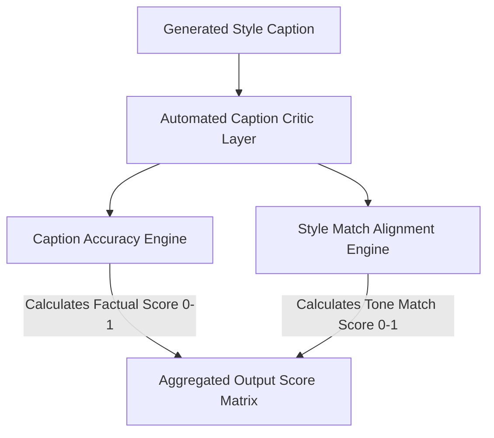

# ML Training and Evaluation

**Project:** CaptionForge AI  
**Document:** 18_ML_Training_and_Evaluation.md  
**Version:** 1.0 (Production Blueprint)

---

## 1. Executive Summary
This document outlines the machine learning training pipeline, data strategy, and validation matrix for **CaptionForge AI**, optimized for Track 2 of the AMD Developer Hackathon. To build an agent capable of generalizing across unseen evaluation videos without relying on hardcoded logic, the strategy focuses on **multimodal synthetic data generation**, **prompt tuning/low-rank adaptation (LoRA)**, and **automated critique-driven evaluation**.

---

## 2. Dataset Strategy & Data Curation

### 2.1. Ground Truth Collection
The pipeline utilizes a multi-source data matrix comprising public semantic video datasets (e.g., ActivityNet, VideoCC) alongside a highly specialized, synthetically generated text dataset mapped to the four required hackathon styles.

```text
data_pipeline/
├── raw_videos/           # Source clip inputs (Nature, Urban, Tech, Office)
├── frame_tokens/         # JSON outputs from Qwen2.5-VL frame extractions
├── synthetic_generation/ # LLM scripts for style expansion mapping
└── splits/
    ├── train.json        # 70% distribution for prompt tuning / fine-tuning
    ├── validation.json   # 15% distribution for target-alignment checking
    └── test.json         # 15% distribution for zero-shot accuracy evaluation
```

### 2.2. Synthetic Style Inflation Pipeline
For every video clip in the training set, a baseline factual description is extracted. This description is then programmatically expanded into four high-quality ground-truth captions using an offline generative suite running distinct stylistic seed variations:
1.  **Formal Variant Generation:** Factual description stripped of emotional adjectives, structured using third-person passive voice.
2.  **Sarcastic Variant Generation:** Focuses on repetitive micro-actions, utilizing ironies and dry text inflections.
3.  **Humorous-Tech Variant Generation:** Standard actions are translated using code syntax, Git workflows, and deployment metaphors.
4.  **Humorous-Non-Tech Variant Generation:** Mapped to observational sitcom humor and common situational tropes.

---

## 3. Model Training & Optimization Setup

### 3.1. Compute Configuration (AMD ROCm Execution)
Training operations utilize localized PyTorch execution frameworks compiled directly for **AMD ROCm compute layers**. 
*   **Precision Mode:** Mixed Precision (bfloat16) to maximize memory throughput on local compute hardware.
*   **Strategy:** Parameter-Efficient Fine-Tuning (PEFT) using LoRA (Low-Rank Adaptation) targets on the Qwen2.5-VL cross-attention projections to minimize structural footprint.

```python
from transformers import TrainingArguments
from peft import LoraConfig, TaskType

lora_config = LoraConfig(
    r=16,
    lora_alpha=32,
    target_modules=["q_proj", "v_proj", "k_proj", "o_proj"],
    lora_dropout=0.05,
    bias="none",
    task_type=TaskType.CAUSAL_LM
)

training_args = TrainingArguments(
    output_dir="./checkpoints",
    per_device_train_batch_size=2,
    gradient_accumulation_steps=4,
    learning_rate=2e-5,
    weight_decay=0.01,
    bf16=True, 
    logging_steps=10,
    evaluation_strategy="steps",
    eval_steps=50,
    save_strategy="steps",
    save_steps=100,
    warmup_ratio=0.03,
    dataloader_num_workers=4
)
```

---

## 4. Evaluation Metrics & Judges Architecture

Each generated caption is programmatically scored across the two core validation dimensions evaluated by the hackathon's internal automated testing harness.



### 4.1. Dimension 1: Caption Accuracy ($0.0 \rightarrow 1.0$)
*   **Definition:** Measures how faithfully the generated caption reflects the true visual elements, objects, and actions present in the video clip.
*   **Automated Evaluation Check:** Uses semantic entailment models to check that objects mentioned in the text caption match the verified token inventory generated by the spatial detection layers. 
*   **Penalty Rules:** Strict deductions are triggered if the caption contains any unverified objects (hallucinations) or misinterprets the sequential order of actions.

### 4.2. Dimension 2: Style Match ($0.0 \rightarrow 1.0$)
*   **Definition:** Measures how accurately the caption reflects the targeted tone (Formal, Sarcastic, Humorous-Tech, Humorous-Non-Tech).
*   **Automated Evaluation Check:** Uses a classifier to analyze text style markers, vocabulary patterns, and tone markers.
*   **Penalty Rules:** Technical jargon found in a "Humorous-Non-Tech" caption or objective language found in a "Sarcastic" output triggers a drop in the style match score.

---

## 5. Validation Loops & Benchmarking

To prevent overfitting on the provided sample video clips, the model uses an automated validation loop during training.

1.  **Zero-Shot Generalization Test:** At regular intervals, the pipeline processes novel videos from the validation set containing completely unseen settings (e.g., sports, cooking, weather).
2.  **Prompt Regression Audit:** Checks that improvements in one specific style (e.g., Humorous-Tech) do not negatively impact the scores of another style (e.g., Formal).
3.  **JSON Schema Validation:** Verifies that all validation iterations consistently output clean, valid JSON structures that match the target submission schema (`/output/results.json`), preventing parsing errors during evaluation.

---

## 6. Final Sign-off

*   **Status:** APPROVED
*   **Implementation Target:** Core Training Pipeline Validation Layer

---