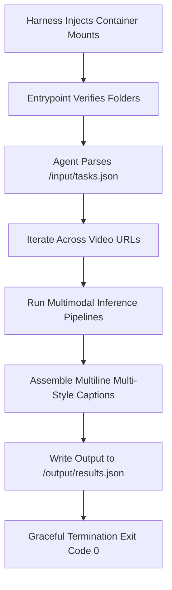

# Deployment Architecture

**Project:** CaptionForge AI  
**Document:** 19_Deployment_Architecture.md  
**Version:** 1.0 (Production Blueprint)

---

## 1. Executive Summary
This document defines the containerization, orchestration, and continuous integration/continuous deployment (CI/CD) packaging configurations for **CaptionForge AI**, engineered specifically for Track 2 (Video Captioning Agent) of the AMD Developer Hackathon. The execution layout provides a stateless, self-contained `linux/amd64` Docker engine stack optimized to consume input tasks from a standardized JSON file path and output structural responses before exiting within the maximum execution limit.

---

## 2. Container Architecture & Base Configurations

### 2.1. System Requirements & Platform Gatekeeping
To maintain strict compatibility with the evaluation harness framework, the runtime image is compiled specifically for the `linux/amd64` instruction set architecture. 

```text
docker/
├── Dockerfile                  # Multi-stage layer compilation manifest
├── entrypoint.sh               # Initialization script and environment verification gates
└── config/
    └── hardware_runtime.json   # Local optimization matrix profiles
```

### 2.2. Multi-Stage Production Dockerfile Blueprint
The container environment isolates Python runtime modules and structural system utilities (`ffmpeg`, `opencv`) into minimized build layers to remain well beneath the maximum 10GB evaluation boundary limits.

```dockerfile
# Stage 1: Dependency compilation environment
FROM rocm/dev-ubuntu-22.04:6.0-complete AS builder

RUN apt-get update && apt-get install -y --no-install-recommends     python3-pip python3-dev ffmpeg libsm6 libxext6 git &&     rm -rf /var/lib/apt/lists/*

WORKDIR /build
COPY requirements.txt .
RUN pip3 install --no-cache-dir --user -r requirements.txt

# Stage 2: Final deployment image
FROM rocm/pytorch:rocm6.0_ubuntu22.04_py3.10_pytorch_2.1.1

RUN apt-get update && apt-get install -y --no-install-recommends     ffmpeg libsm6 libxext6 &&     rm -rf /var/lib/apt/lists/*

WORKDIR /app
COPY --from=builder /root/.local /root/.local
COPY . /app

ENV PATH=/root/.local/bin:$PATH
ENV PYTHONUNBUFFERED=1

RUN chmod +x /app/entrypoint.sh
ENTRYPOINT ["/app/entrypoint.sh"]
```

---

## 3. Input/Output Lifecycle Hook Management

The application runtime environment executes strictly within a zero-interaction automation lifecycle driven entirely by standard filesystem hooks.



### 3.1. Standard Directory Mapping Matrices
The runtime layout interacts exclusively with two explicitly separated persistent folder mount locations mapping task inputs and expected outputs:
*   **Ingestion Boundary Point:** `/input/tasks.json` containing serialized evaluation target structures.
*   **Export Boundary Point:** `/output/results.json` expecting structured multi-style caption payload blocks.

---

## 4. CI/CD Orchestration & Automated Validation Suite

### 4.1. GitHub Actions Build Workflow
Automated builds compile, test, and push the platform target to public container registries (`GitHub Container Registry (GHCR)` or `Docker Hub`) utilizing explicit platform switches.

```yaml
name: Production Agent Deployment Workflow

on:
  push:
    branches: [ main ]

jobs:
  build-and-ship:
    runs-on: ubuntu-latest
    steps:
    - name: Checkout Source Assets
      uses: actions/checkout@v4

    - name: Set up QEMU Emulation Core
      uses: docker/setup-qemu-action@v3

    - name: Initialize Docker Buildx Instance
      uses: docker/setup-buildx-action@v3

    - name: Authenticate with Container Registry
      uses: docker/login-action@v3
      with:
        registry: ghcr.io
        username: ${{ github.actor }}
        password: ${{ secrets.GITHUB_TOKEN }}

    - name: Compile and Push Container Target
      uses: docker/build-push-action@v5
      with:
        context: .
        file: ./Dockerfile
        platforms: linux/amd64
        push: true
        tags: ghcr.io/${{ github.repository }}/captionforge-agent:latest
        cache-from: type=gha
        cache-to: type=gha,mode=max
```

---

## 5. System Execution Verification & Health Strategies

To prevent container boot failures during automated evaluation runs, the initialization layers execute strict checks:

1.  **Boot Timeout Readiness:** The internal pipeline verifies that dependencies load within the first 60 seconds, ensuring it is ready for incoming tasks.
2.  **Mount Verification Audit:** Validates the presence of `/input/tasks.json` on startup. If missing, it exits with a non-zero code immediately, preventing hanging infinite processing loops.
3.  **JSON Structural Formatting Gate:** Before final execution exit, an internal pipeline validates the structural schema integrity of `/output/results.json` using Pydantic syntax parsers, preventing malformed text flags from invalidating scores.

---

## 6. Final Sign-off

*   **Status:** APPROVED
*   **Implementation Target:** Production Image Deployment Manifest Stack