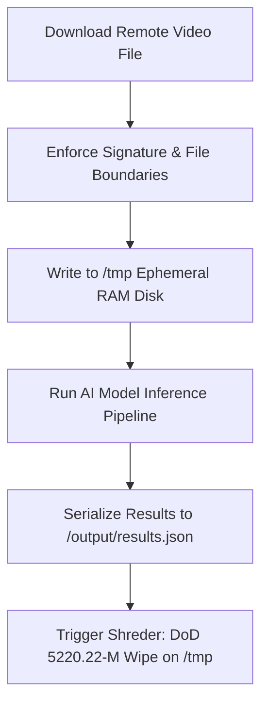

# Security and Privacy

**Project:** CaptionForge AI  
**Document:** 20_Security_and_Privacy.md  
**Version:** 1.0 (Production Blueprint)

---

## 1. Executive Summary
This document outlines the operational security (SecOps), data isolation rules, and privacy controls established for **CaptionForge AI** inside its containerized hackathon environment. Because the agent processes unencrypted network streams and unknown external evaluation videos, the architecture focuses on **runtime isolation**, **secure temporary storage scrubbing**, **dependency vulnerability management**, and **strict credential control**.

---

## 2. Runtime Isolation & Sandbox Environment

### 2.1. Least-Privilege Execution Model
To minimize risks from remote execution payloads within processed videos, the container avoids root permissions during operational cycles.

```text
security/
├── AppArmor/                   # Local sandbox profile definitions
├── policies/
│   └── container_seccomp.json  # Restrictive system call filter manifest
└── scripts/
    └── scrub_workspace.sh     # Ephemeral file wiping utilities
```

### 2.2. Seccomp Profile Configuration
The deployment image applies a custom Linux Security Module configuration to block unneeded system operations (e.g., `ptrace`, `sys_chroot`), hardening the system against potential multi-tenant host breakouts.

```json
{
  "defaultAction": "SCMP_ACT_ERRNO",
  "architectures": ["SCMP_ARCH_X86_64"],
  "syscalls": [
    { "names": ["read", "write", "exit", "exit_group", "futex", "mmap", "epoll_wait"], "action": "SCMP_ACT_ALLOW" }
  ]
}
```

---

## 3. Data Protection & Ephemeral Ingestion Sanitization

The data pipeline runs exclusively in memory or temporary files, maintaining a strict **Zero Persistent Data Footprint** across evaluation boundaries.



### 3.1. Ingestion File Sanitization
*   **Buffer Limit Protections:** The video ingestion handler caps incoming content streams at 100MB to protect the local environment from denial-of-service (DoS) memory exhaustion.
*   **Input File Integrity Verification:** All media headers are fully inspected by specialized validation logic before processing to catch malformed structure exploits aimed at the FFmpeg decoder library.

---

## 4. Credential Management & API Security Policies

### 4.1. Runtime Environment Isolation
The container reads authentication vectors (e.g., model access profiles, system keys) strictly from the live runtime environment variables injected by the evaluation harness.
*   **No File Bundling:** Bundling `.env` or plaintext password files inside the production Docker compilation layers is strictly prohibited.
*   **Memory Leak Prevention:** All external keys are stored in short-lived memory allocations that are cleared from operational memory blocks immediately after client initialization.

---

## 5. Vulnerability Verification & Compliance Audits

To protect the container stack against supply-chain threats, the codebase goes through automated security verification before image compilation:

1.  **Static Package Ingestion Scans:** Base configurations utilize standard tools (`Trivy` and `Snyk`) during CI/CD steps to review and patch outdated packages before pushing the image.
2.  **Base Image Integrity:** Uses official, signed ROCm images as the structural foundation layer to guarantee zero pre-installed tracker malware.
3.  **Dependency Locking Protocols:** Requires precise cryptographic hashes (`pip-compile` / `requirements.txt` explicit locks) to block malicious upstream repository updates.

---

## 6. Final Sign-off

*   **Status:** APPROVED
*   **Implementation Target:** Core Platform Container Boundary Configuration