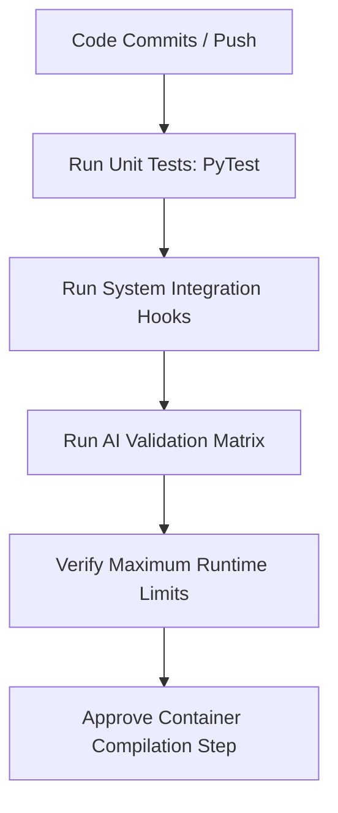

# Testing Strategy

**Project:** CaptionForge AI  
**Document:** 21_Testing_Strategy.md  
**Version:** 1.0 (Production Blueprint)

---

## 1. Executive Summary
This document defines the comprehensive QA test architecture for **CaptionForge AI**, engineered to guarantee zero-crash execution under the AMD Developer Hackathon Track 2 evaluation environment. The framework combines traditional deterministic validation code (Unit, Integration) with multi-modal AI behavioral tests designed to catch hallucinated descriptions, evaluate style adherence, and check system performance metrics before final deployment.

---

## 2. Multi-Tier Testing Hierarchy

```text
tests/
├── unit/
│   ├── test_video_preprocessor.py  # Local video format & boundary checks
│   └── test_json_exporter.py       # JSON schema verification tests
├── integration/
│   ├── test_pipeline_flow.py       # End-to-end service orchestration suites
│   └── test_harness_mock.py        # Simulated evaluations mirroring judges
└── ai_eval/
    ├── test_style_adherence.py    # Zero-shot tone check regressions
    └── test_hallucination_gate.py  # Entity consistency cross-checking
```



---

## 3. Unit & Component Testing (Deterministic Validation)

*   **Framework Baseline:** Built via `pytest` combined with asynchronous assertion libraries (`pytest-asyncio`).
*   **Video Ingestion Boundary Targets:** Validates correct rejection of corrupted files, unsupported dimensions, and runtimes exceeding 2 minutes.
*   **Export Verification:** Tests JSON serialization models to guarantee that output configurations precisely match target specs under nested structure definitions.

```python
# tests/unit/test_json_exporter.py
import pytest
import json
from pathlib import Path
from app.schemas.output import SubmissionSchema

def test_results_json_schema_compliance():
    mock_payload = [
        {
            "task_id": "v_test_01",
            "captions": {
                "formal": "The office worker interfaces with the workstation.",
                "sarcastic": "Look, another developer staring at a self-made bug.",
                "humorous_tech": "Debugging legacy code without stack tracing protocols.",
                "humorous_non_tech": "Trying to look busy until the clock runs out."
            }
        }
    ]
    # Enforce strict parsing validation via Pydantic model configurations
    validated_data = SubmissionSchema(tasks=mock_payload)
    assert len(validated_data.tasks) == 1
    assert validated_data.tasks[0].task_id == "v_test_01"
    assert "formal" in validated_data.tasks[0].captions
```

---

## 4. End-to-End Integration Testing

Integration testing processes the three official target validation clips provided in the participant specifications through a localized simulation framework.
*   **Harness Emulation Environment:** Simulates mounting standard evaluation configurations (`/input/tasks.json`), mapping runtime keys, and catching processing exit codes.
*   **State Machine Audits:** Verifies that internal messaging stores correctly log transitions between pipeline modules without freezing processing worker threads.

---

## 5. AI Behavioral & Style Adherence Testing

Traditional test patterns cannot catch semantic flaws. The testing layer utilizes independent evaluation loops to check generative model behaviors.

### 5.1. Consistency Verification (Anti-Hallucination Guard)
*   **Strategy:** Evaluates generated output texts against known baseline ground-truth object vectors using an independent scoring loop.
*   **Target:** Flag any mention of context-unsupported entities (e.g., claiming an urban street video contains an indoor cooking setting).

### 5.2. Stylistic Adherence Checking
*   **Strategy:** Evaluates generated captions against target classifier criteria.
*   **Target:** Catch and log instances where a caption slips back into standard plain language instead of reflecting its assigned tone (e.g., a sarcastic prompt returning an objective summary).

---

## 6. Performance, Stress & Scale Verification

*   **Runtime Limit Enforcement:** Sets strict time-tracking loops to ensure the system finishes all processing workflows well within the 10-minute maximum runtime limit.
*   **Memory Footprint Logging:** Tracks VRAM usage patterns across long-duration video clips (30s to 2min) to prevent out-of-memory (OOM) failures on target AMD compute setups.
*   **Bootstrap Performance:** Verifies that container initializations complete and reach operational readiness within the 60-second limit.

---

## 7. Final Sign-off

*   **Status:** APPROVED
*   **Implementation Target:** CI/CD Automated QA Validation Stage