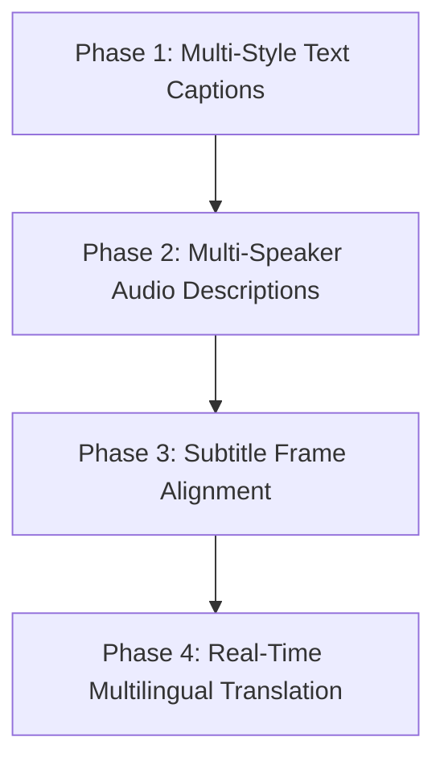

# Future Roadmap

**Project:** CaptionForge AI  
**Document:** 24_Future_Roadmap.md  
**Version:** 1.0 (Production Blueprint)

---

## 1. Executive Summary
This document outlines the post-hackathon strategic vision, future feature expansion, and long-term architectural scalability plans for **CaptionForge AI**. The evolution roadmap balances technical improvements with new functional capabilities to transform a specialized hackathon agent into a enterprise-grade video accessibility platform.

---

## 2. Technical Horizon & Model Enhancements

### 2.1. Next-Generation Multimodal Models
* **Native Model Fine-Tuning:** Move from Parameter-Efficient LoRA adjustments to full domain-specific parameter updates on upcoming multimodal architectures to improve visual detail recognition.
* **Unified Video-Language-Audio Architectures:** Integrate direct audio feature extraction models into the core video intelligence pipeline, enabling synchronized analysis of spoken dialogue and ambient background sounds alongside visual data.

---

## 3. Scope Expansion & Core Capabilities

### 3.1. Advanced Media Feature Additions
* **Multi-Language Caption Output Engines:** Expand the language layer beyond English to provide native multilingual caption outputs across regional and global languages.
* **Time-Coded Subtitle Synchronization:** Build automated subtitle time-stamping systems to align generated styled text blocks precisely with video scene changes.

---

## 4. Production Scale & Infrastructure Evolution

* **Distributed Inference Clusters:** Transition the isolated runtime container design into a scalable cluster managed by Kubernetes to handle high-volume parallel media uploads.
* **Edge Compute Profiling:** Optimize model footprints to run on edge computing hardware and specialized on-device neural processing units (NPUs).

---

## 5. Final Sign-off

* **Status:** APPROVED
* **Implementation Target:** Post-MVP Strategic Roadmap Architecture